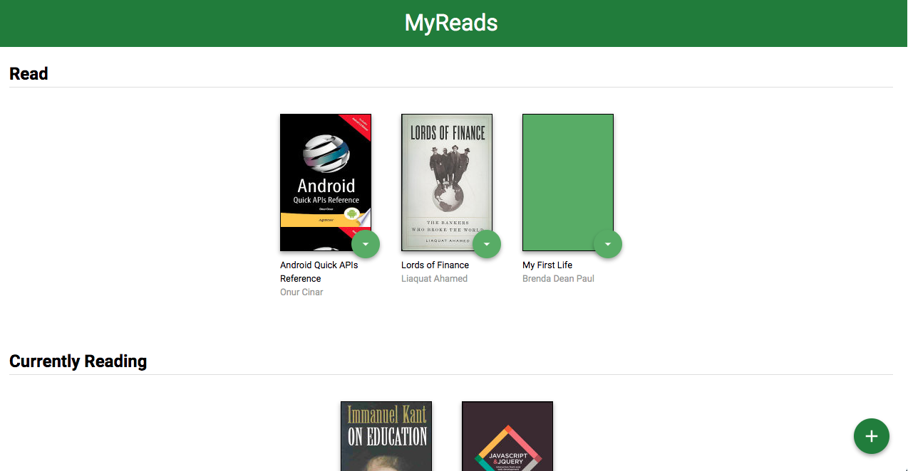
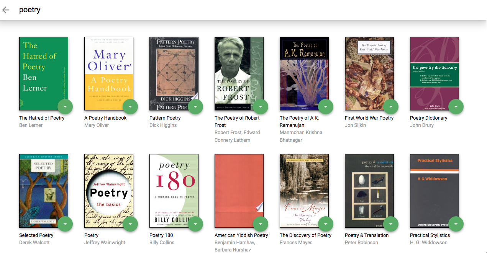

# MyReads Project

This application consists of allowing the user to keep track of his readings, being able to separate them into shelves, such as the books he has read, the ones he is reading and the ones he wants to read.

To start the project, be sure to install the package manager to your preference, like *npm or yarn* using the code line inside the repository that you've downloaded the MyRead Project:
*npm install*
if you prefer use the yarn package manager, use this code:
*npm install --global yarn*

After installing the *npm* (or *yarn*), all you need to do is start the project, using the *npm start* or *yarn start*

Here's an example of how should the app render:
=>**Main Page**

=>**Search Page**

